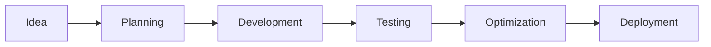

<div align="center">


<br>


<br><br>


</div>

---

# Professional Profile

I am a Systems Engineering and Computer Science student focused on software development, backend technologies, and database management.

My primary objective is to continuously improve my technical skills while building scalable, efficient, and well-structured applications. I enjoy solving problems, learning new technologies, and working on projects that combine performance, functionality, and clean design principles.

My current learning path is strongly connected to backend development with Java, relational database systems, software architecture, APIs, and modern development workflows.

I have experience working with development environments, version control systems, SQL databases, and technical documentation. I am constantly exploring technologies and methodologies that improve software quality and development efficiency.

---

# Technologies & Tools

<div align="center">

<a href="https://www.java.com/" target="_blank">

</a>

<a href="https://www.postgresql.org/" target="_blank">

</a>

<a href="https://www.mysql.com/" target="_blank">

</a>

<a href="https://git-scm.com/" target="_blank">

</a>

<a href="https://github.com/" target="_blank">

</a>

<a href="https://code.visualstudio.com/" target="_blank">

</a>

<a href="https://netbeans.apache.org/" target="_blank">

</a>

<a href="https://developer.mozilla.org/en-US/docs/Web/HTML" target="_blank">

</a>

<a href="https://developer.mozilla.org/en-US/docs/Web/CSS" target="_blank">

</a>

</div>

---

# Technical Competencies

<div align="center">

<table>
<tr>
<td width="50%">

### Backend Development

```txt
Java                80%
SQL                 78%
API Connectivity    65%
Application Logic   82%
```

</td>

<td width="50%">

### Database Management

```txt
PostgreSQL          75%
MySQL               72%
Database Design     70%
Optimization        60%
```

</td>
</tr>
</table>

</div>

---

# Current Focus

```yaml
Software Development:
  - Backend Applications
  - Database Connectivity
  - Java Architecture
  - API Integration

Learning:
  - Scalable Systems
  - Clean Architecture
  - Development Best Practices
  - Database Optimization

Goals:
  - Build Professional Projects
  - Improve Software Logic
  - Strengthen Backend Skills
  - Gain Real Development Experience
```

---


---

# Development Environment

<div align="center">


</div>

<br>

<div align="center">


</div>

---

# Workflow

<div align="center">



</div>

---

# Repository Structure

```txt
📦 Projects
 ┣ 📂 Backend Applications
 ┣ 📂 Database Projects
 ┣ 📂 Java Practice
 ┣ 📂 Documentation
 ┗ 📂 Experimental Projects
```

---

# Contact & Links

<div align="center">

<a href="https://github.com/TU_USUARIO">

</a>

<a href="https://www.linkedin.com/">

</a>

</div>

---

<div align="center">


</div>
