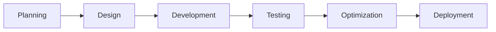

<div align="center">


<br>


<br><br>

<a href="https://github.com/TU_USUARIO">

</a>

<a href="https://github.com/TU_USUARIO">

</a>


</div>

---

# About Me

```java
public class EdwinRamirez {

    String role = "Software Developer";
    String focus = "Backend Development";
    
    String[] languages = {
        "Java",
        "SQL",
        "HTML",
        "CSS"
    };

    String[] databases = {
        "PostgreSQL",
        "MySQL"
    };

    String[] tools = {
        "Git",
        "GitHub",
        "VS Code",
        "NetBeans"
    };

    String objective = 
        "Build scalable, efficient and professional software solutions.";
}
```

---

# Tech Stack

<div align="center">

<a href="https://www.java.com/" target="_blank">

</a>

<a href="https://www.postgresql.org/" target="_blank">

</a>

<a href="https://www.mysql.com/" target="_blank">

</a>

<a href="https://git-scm.com/" target="_blank">

</a>

<a href="https://github.com/" target="_blank">

</a>

<a href="https://code.visualstudio.com/" target="_blank">

</a>

<a href="https://netbeans.apache.org/" target="_blank">

</a>

<a href="https://developer.mozilla.org/en-US/docs/Web/HTML" target="_blank">

</a>

<a href="https://developer.mozilla.org/en-US/docs/Web/CSS" target="_blank">

</a>

</div>

---

# Technical Skills

<div align="center">

<table>
<tr>
<td width="50%">

### Backend Development


</td>

<td width="50%">

### Database Management


</td>
</tr>
</table>

</div>

---


---


---

# Current Focus

```yaml
Backend Development:
  - Java Applications
  - API Integration
  - Database Connectivity

Software Engineering:
  - Clean Architecture
  - Scalable Systems
  - Development Best Practices

Database Management:
  - PostgreSQL
  - MySQL
  - Query Optimization
```

---

# Workflow

<div align="center">



</div>

---

# Development Environment

<div align="center">


</div>

---

# Repository Structure

```txt
📦 Projects
 ┣ 📂 Backend Applications
 ┣ 📂 Database Projects
 ┣ 📂 Java Development
 ┣ 📂 Software Documentation
 ┗ 📂 Experimental Projects
```

---

# Connect With Me

<div align="center">

<a href="https://github.com/TU_USUARIO">

</a>

<a href="https://www.linkedin.com/">

</a>

<a href="mailto:TU_CORREO">

</a>

</div>

---

<div align="center">


<br><br>


</div>
